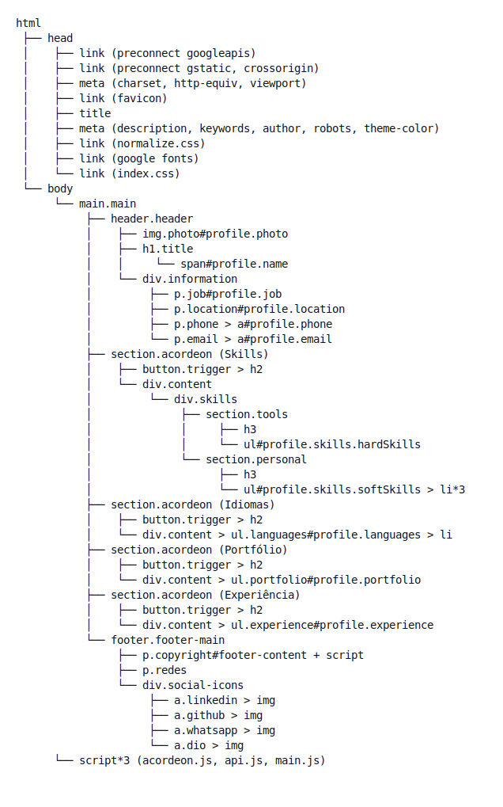
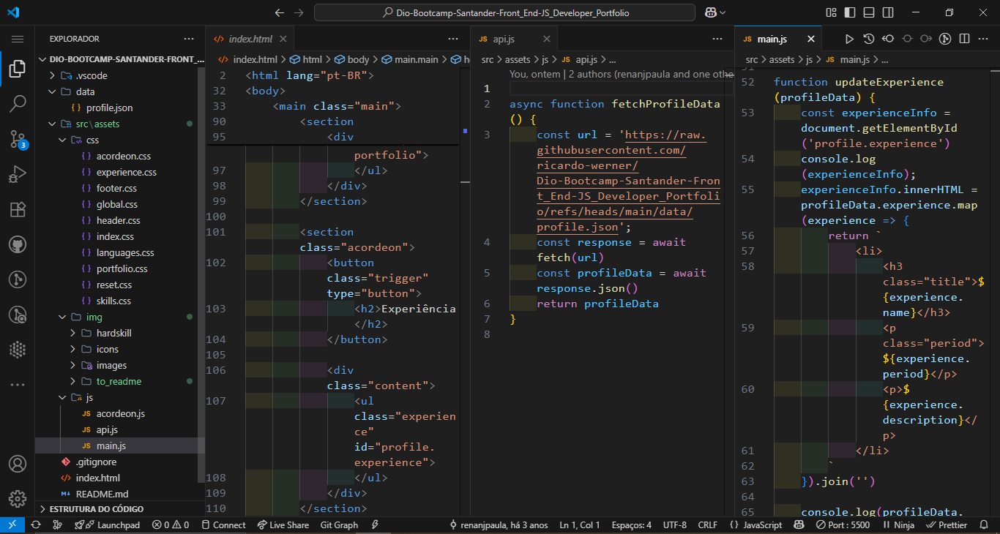
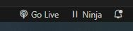
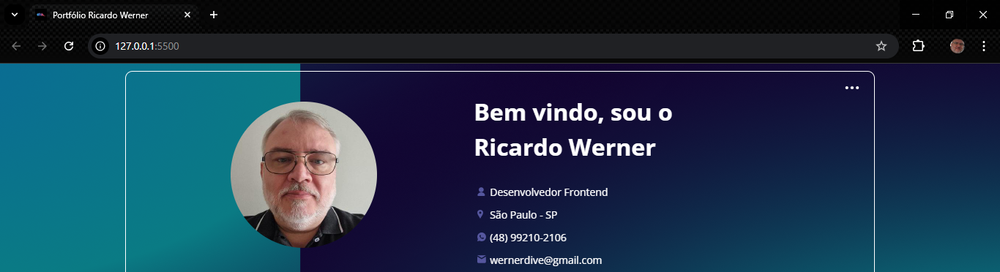

# Dio-Bootcamp-Santander-Front_End-JS_Developer_Portfólio

## Este projeto foi desenvolvido como parte do **Bootcamp Santander Front-End - DIO**. O objetivo é aplicar os todos os conhecimentos adquiridos em HTML, CSS e Javascript por meio da construção de uma um Portfólio pessoal.

### 🔗 Deploy

🔗 Acesse a página publicada aqui:  
👉 

---

### 📜 Sobre o Projeto

O desafio consiste em criar uma página de portfólio web simples, aplicando além das tags HTML abordadas nas aulas, as estilizações aprendidas e a utilização do Javascript com o consumo de API e aplicar a responsividade para os dispositivos existentes, acessibilidade e SEO.

### 🧠 Mapa da Estrutura do DOM

Abaixo está o fluxograma representando a estrutura do DOM utilizada neste projeto. Ele reflete a organização semântica do HTML, separando áreas como navegação, conteúdo principal, seções e elementos visuais.

<p align="center">
  
</p>

---

### ✅ Status do Projeto

🟡 **Em Desenvolvimento**

---

### 🚀 Plano do Projeto

| Etapa | Descrição                                                              |
| ----- | -----------------------------------------------------------------------| 
| 1     | Estruturação HTML com tags semânticas e para acessibilidade            |
| 2     | Estilização CSS externa com variáveis e responsividade                 |
| 3     | Javascript utilizado para criar toda a interatividade da página        |
| 4     | Layout com flexbox e CSS Grid                                          |
| 5     | Aplicação de boas práticas de acessibilidade e SEO                     |
| 6     | Inclusão de imagens, ícones e ajustes para portfólio                   |

---

### 📝 Requisitos da Aplicação

| Item | Requisito                                                                |
| ---- | ------------------------------------------------------------------------ |
| 1    | A página deve ser desenvolvida em HTML, CSS e Jascript                   |
| 2    | Utilizar tags semânticas e acessibilidade                                |
| 3    | CSS externo, uso de variáveis e `font-size: 62.5%` (para usar `rem`)     |
| 4    | Javascript para interatividade       |
| 5    | Estrutura responsiva (mobile-first ou adaptável)                         |
| 6    | Projeto com dependências externas de JavaScript                          |
| 7    | Possibilidade de uso como template de portfólio futuramente              |
| 8    | Design da página no Figma:  https://shre.ink/S2ux                        |

---

### 🧩 Exibição da Página

#### 🖼️ Tela da Landing Page

<p align="center">
  
</p>

#### 🖼️ Tela com código HTML e CSS

<p align="center">
  
</p>

---

### 🛠 Tecnologias Utilizadas

- **HTML5**
- **CSS3 (com variáveis, responsividade)**
- **Javascript**
- **Visual Studio Code + Live Server**
- **ChatGPT (para apoio técnico e estruturação)**

---

### 🎯 Funcionalidades Técnicas Aplicadas

| Recurso                   | Aplicado |
| ------------------------- | -------- |
| Tags semânticas HTML      | ✅       |
| CSS externo com variáveis | ✅       |
| Jascript                  | ✅       |
| Layout responsivo         | ✅       |
| Acessibilidade básica     | ✅       |
| Preparação para SEO       | ✅       |

---

### 📦 Como Executar o Projeto

1. **Clone o repositório:**

```bash
git clone https://github.com/ricardo-werner/Dio-Bootcamp-Santander-Front_End-JS_Developer_Portfolio.git
```

2. Abra o projeto no VS Code

3. Ative o Go Live:

  <p align="center">
     
  </p>

  <p align="center">
     
  </p>

4. Visualize o resultado:

  <p align="center">
    
  </p>

---

💡 Reflexões
Desenvolver este projeto reforçou meu conhecimento na importância de compreender os fundamentos do HTML e CSS.
Também serviu como um novo modo para estruturar um portfólio mais completo, com acessibilidade e boas práticas de SEO.

---

🔗 Links Úteis

- [](https://www.github.com/ricardo-werner)

- [](https://linkedin.com/in/ricardo-werner)

---

🙋‍♂️ Autor:&nbsp;&nbsp;
Ricardo Werner - 
Desenvolvedor Front-end & Acessibilidade (A11Y) & Inclusão Digital
